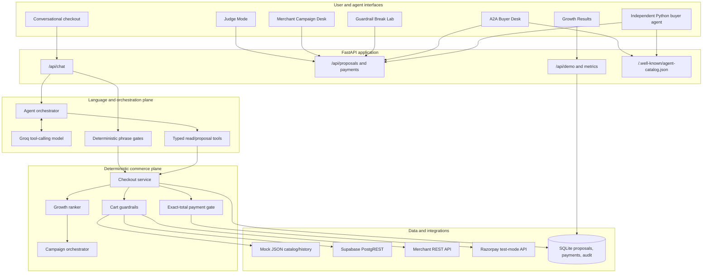
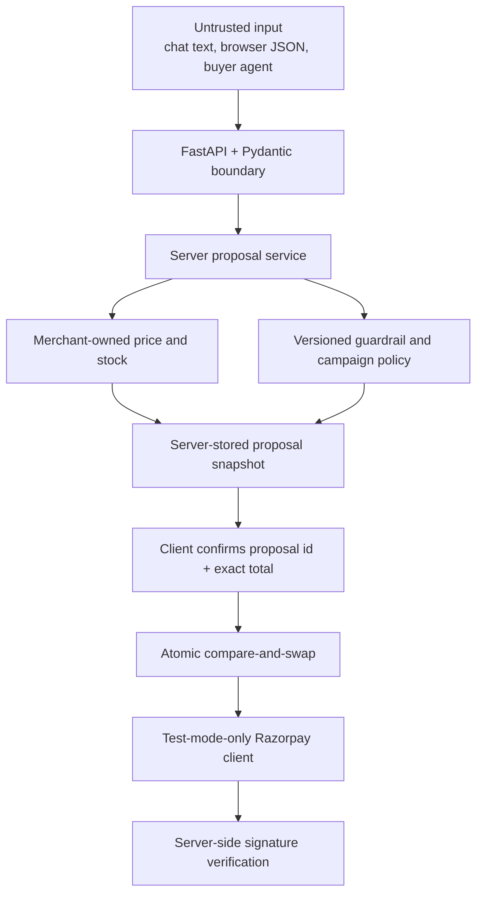
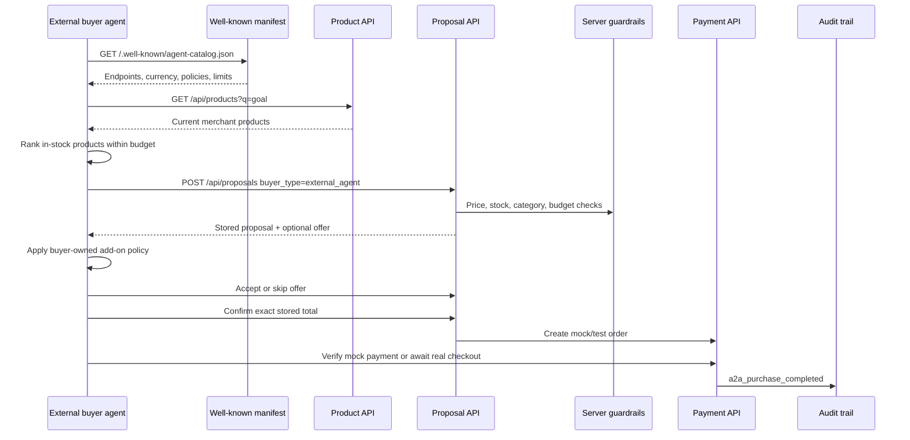
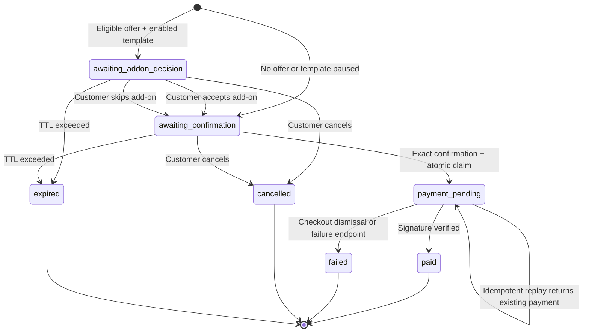
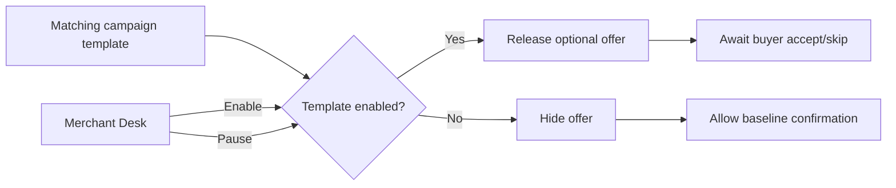
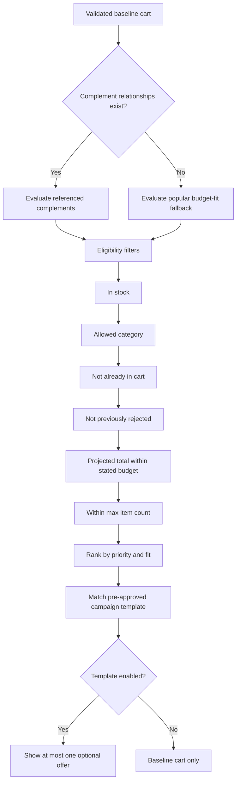
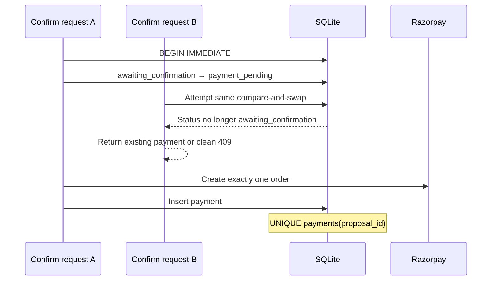

# Agentic Growth & Conversational Checkout

> Razorpay AI Buildathon · Track 01 — AI Growth & Agentic Commerce

An auditable commerce agent that turns a natural-language purchase request into a bounded checkout proposal, recommends at most one policy-approved add-on, requires explicit customer confirmation, and creates a Razorpay **test-mode** order. The same merchant can also be discovered and transacted with by an independent buyer agent over public HTTP APIs.

The central design rule is simple:

> The model may interpret intent and choose tools. Deterministic application code owns products, prices, budgets, inventory, campaign policy, confirmation gates, and payment execution.

This project targets the official Track 01 bar: grow merchant revenue or make the merchant transactable by an AI buyer, while keeping every money action explainable, bounded, gated, auditable, and recoverable. See the [Razorpay AI Buildathon brief](https://razorpay.com/buildathon/).

---

## Contents

- [What the product does](#what-the-product-does)
- [Demo modes](#demo-modes)
- [Why this is agentic](#why-this-is-agentic)
- [Architecture](#architecture)
- [Trust and authority boundaries](#trust-and-authority-boundaries)
- [Human checkout flow](#human-checkout-flow)
- [Buyer-agent flow](#buyer-agent-flow)
- [Proposal and payment state machine](#proposal-and-payment-state-machine)
- [Growth decision pipeline](#growth-decision-pipeline)
- [Guardrails and invariants](#guardrails-and-invariants)
- [Audit trail and measured results](#audit-trail-and-measured-results)
- [Frontend demo surfaces](#frontend-demo-surfaces)
- [Quick start](#quick-start)
- [Configuration](#configuration)
- [API reference](#api-reference)
- [Reproducible demo walkthrough](#reproducible-demo-walkthrough)
- [Testing](#testing)
- [Failure handling](#failure-handling)
- [Repository map](#repository-map)
- [Current scope and limitations](#current-scope-and-limitations)

---

## What the product does

The project combines five connected capabilities:

1. **Conversational checkout** — Groq tool calling translates requests such as “Order my usual, under ₹800” into catalog, history, and proposal operations.
2. **Revenue growth** — a deterministic ranker selects one eligible complement or budget-fitting popular product and measures projected versus realized uplift.
3. **Merchant campaign control** — merchants enable or pause pre-approved growth templates; checkout never invents a campaign or discount.
4. **Safe payment execution** — server-owned pricing, exact-total confirmation, atomic proposal claiming, idempotency, and Razorpay test-mode enforcement protect every money action.
5. **Agent-to-agent commerce** — an independent buyer agent discovers a machine-readable merchant manifest, searches the catalog, evaluates an offer, confirms the stored total, and completes a mock/test checkout using only public APIs.

### Capability matrix

| Capability | Implementation | Authority |
|---|---|---|
| Interpret natural-language purchase intent | Groq using an OpenAI-compatible tool-calling API | LLM |
| Search products and retrieve history | Typed read-only tools | Merchant data source |
| Construct a proposal | Deterministic checkout service | Server |
| Resolve prices and inventory | Mock JSON, REST merchant API, or Supabase | Merchant data source |
| Rank an add-on | Deterministic complement/popularity rules | Server policy |
| Select campaign and copy | `campaigns.json` templates | Merchant policy |
| Accept or skip add-on | Explicit customer/agent action | Buyer |
| Confirm payment | Exact proposal, total, and owner gate | Buyer + server |
| Create Razorpay order | Razorpay wrapper, test mode only | Payment service |
| Mark payment paid | Signature verification | Server + Razorpay response |
| Compute growth and safety metrics | Fold over append-only audit events | Audit trail |

---

## Demo modes

The same application supports two intentionally different data modes.

### 1. Frozen mock demo

Use this mode for the deterministic Buildathon hero story and automated evaluation.

| Step | Result |
|---|---|
| Customer request | “Order my usual, under ₹800” |
| Completed-order history | Daily Protein Bundle — ₹699 |
| Eligible complement | Shaker Bottle — ₹99 |
| Projected total | ₹798 |
| Customer decision | Explicit accept or skip |
| Payment decision | Separate explicit confirmation |
| Growth result after verified payment | ₹99 realized uplift, approximately 14.2% |

Run the backend with:

```bash
USE_MOCK_CATALOG=true \
STORE_PROVIDER=mock \
DEMO_USER_ID=demo_user_01 \
uvicorn backend.main:app --reload --app-dir . --port 8000
```

### 2. Live merchant demo

When `STORE_PROVIDER=supabase` or `STORE_PROVIDER=rest`, the application uses the merchant’s actual catalog, inventory, and completed-order history.

In live mode:

- Product names, prices, stock, history, and totals are data-dependent.
- If the configured user has completed-order history, “the usual” means the most recent completed order.
- If no completed order exists, the system clearly labels the cart as a **bestseller fallback** and never calls it the user’s usual.
- If a historical item is unavailable, the system builds a separately labelled bestseller fallback.
- The hard safety limits remain identical to mock mode.

The ₹699 → ₹798 numbers belong only to the frozen mock scenario; they are not claimed for arbitrary live merchant data.

---

## Why this is agentic

The conversational agent can reason over a user request and decide which read/proposal tool to call, but it has deliberately limited authority.

### LLM responsibilities

- Understand free-form shopping intent.
- Extract or infer which catalog/history operation is needed.
- Call typed tools for search, history, proposal creation, and proposal status.
- Explain tool-backed results conversationally.
- Fall back gracefully when the model provider is unavailable.

### Deterministic responsibilities

- Product identifiers, prices, quantities, and stock.
- Budget and hard-order ceilings.
- Category denial and substitution rules.
- Add-on eligibility and ranking.
- Merchant template status.
- Add-on acceptance and payment confirmation gates.
- Payment idempotency and concurrency control.
- Razorpay test-mode order creation and signature verification.
- Audit events and business metrics.

### Why the split matters

An open-ended model loop is useful for language, but it is the wrong authority for financial state changes. The model can propose an action; the deterministic commerce plane decides whether that action is legal and executable.

---

## Architecture



### Request-level component view

```mermaid
flowchart LR
    Intent[User intent] --> LLM{Language needed?}
    LLM -->|Yes| Tools[Model selects typed tool]
    LLM -->|No or provider unavailable| Fallback[Deterministic fallback]
    Tools --> Core[Checkout core]
    Fallback --> Core
    Core --> Validate[Re-price and validate server-side]
    Validate --> Proposal[(Stored proposal)]
    Proposal --> Addon{Optional offer pending?}
    Addon -->|Yes| Decision[Explicit accept or skip]
    Addon -->|No| Confirm[Exact-total confirmation]
    Decision --> Confirm
    Confirm --> Claim[Atomic payment claim]
    Claim --> RZP[Razorpay test order]
    RZP --> Verify[Signature verification]
    Verify --> Paid[(Paid + realized uplift)]
```



---

## Trust and authority boundaries



Nothing supplied by the browser or LLM is trusted as a price. A client can request a product ID, but the server resolves the current catalog price and stock before constructing the proposal.

---

## Human checkout flow

```mermaid
sequenceDiagram
    actor Customer
    participant UI as React checkout
    participant Agent as Groq agent
    participant Core as Deterministic checkout core
    participant Store as Merchant catalog/history
    participant Audit as SQLite audit trail
    participant RZP as Razorpay test mode

    Customer->>UI: Order my usual, under ₹800
    UI->>Agent: POST /api/chat
    Agent->>Core: create_proposal_from_usual
    Core->>Store: Read latest completed order and live catalog
    Store-->>Core: Products, price, stock, history
    Core->>Core: Apply cart and campaign guardrails
    Core->>Audit: proposal_created + decision_trace
    Core-->>Agent: Stored proposal + optional offer
    Agent-->>UI: Explain baseline and ask accept/skip

    Customer->>UI: Yes, add it
    UI->>Core: Explicit add-on decision
    Core->>Core: Re-read offered SKU and revalidate cart
    Core->>Audit: addon_accepted + gate_trace
    Core-->>UI: New total; payment still unconfirmed

    Customer->>UI: Confirm payment
    UI->>Core: proposal id + expected total + owner
    Core->>Core: Exact-total gate + atomic claim
    Core->>RZP: Create test-mode order
    Core->>Audit: payment_order_created
    RZP-->>UI: Checkout payload
    UI->>RZP: Complete Razorpay Checkout
    UI->>Core: Payment identifiers + signature
    Core->>Core: Verify signature
    Core->>Audit: payment_verified_paid
    Core-->>UI: Paid + realized uplift
```

There are always two separate customer decisions when an add-on is offered:

1. Accept or skip the optional add-on.
2. Confirm payment for the final stored total.

“Yes” after an add-on question is not payment authorization.

---

## Buyer-agent flow

The independent buyer agent lives in `buyer_agent/` and imports no merchant backend code. It interacts through the same public contract available to any external buyer.



The buyer’s policy currently:

- Searches for `BUYER_WANT`.
- Rejects out-of-stock products and products over `BUYER_BUDGET_INR`.
- Ranks textual matches against product ID, name, category, and tags.
- Accepts an add-on only when its price is at most `BUYER_MAX_ADDON_INR` and the projected total remains within budget.

Run it against a running backend:

```bash
MERCHANT_BASE_URL=http://127.0.0.1:8000 \
BUYER_WANT=protein \
BUYER_BUDGET_INR=800 \
BUYER_MAX_ADDON_INR=150 \
python buyer_agent/run_purchase.py
```

For the frozen mock hero, also set `USE_MOCK_CATALOG=true`, `STORE_PROVIDER=mock`, and `DEMO_USER_ID=demo_user_01` on the backend process.

---

## Proposal and payment state machine



An `awaiting_merchant_approval` compatibility state remains in the domain model for older per-checkout campaign flows. The current default campaign architecture uses **template policy**:



Enabling a template allows future matching checkouts to show its add-on automatically. Pausing a template hides it and retracts matching open offers back to the baseline cart.

---

## Growth decision pipeline

Growth decisions are deterministic and inspectable.



### Recommendation sources

| Source | When used | Meaning |
|---|---|---|
| `catalog_complements` | Catalog contains explicit complement relationships | Merchant-defined product relationship |
| `catalog_complements+co_purchase_history` | Complement also appears in prior completed orders | Relationship with a deterministic history boost |
| `popular_budget_fit` | No complement data is available | Popular eligible product that fits remaining budget |

### Opportunity and campaign separation

The system separates four concepts:

1. **Candidate** — a product that might be eligible.
2. **Opportunity** — a deterministic signal such as `complement_attach` or `new_user_bestseller`.
3. **Campaign** — a merchant-authored template from `backend/data/campaigns.json`.
4. **Offer** — the single product and copy released to the customer after every policy check passes.

The LLM cannot invent a campaign, SKU, discount, segment, or price.

---

## Guardrails and invariants

The default policy is stored in `backend/data/guardrail_policy.json`.

| Invariant | Default | Enforcement point |
|---|---:|---|
| Razorpay mode | `test` only | Settings validation and Razorpay wrapper |
| Hard maximum order value | ₹5,000 | Request model and cart validation |
| Maximum items per proposal | 5 | Cart and growth validation |
| Denied categories | `gift_cards`, `alcohol_adjacent` | Cart and campaign guardrails |
| Proposal lifetime | 10 minutes | Proposal retrieval and confirmation gate |
| Growth recommendations shown | At most 1 | Growth ranker |
| Silent add-on | Forbidden | Stored offer + explicit decision gate |
| Client/LLM price authority | Forbidden | Server catalog lookup |
| Payment confirmation | Exact current total | Confirmation gate |
| Payment owner | Must match when supplied | Confirmation gate |
| Payments per proposal | At most 1 | Atomic state transition + unique DB index |
| Realized uplift | Only after verified payment | Payment verification service |

### Concurrency protection



### Adversarial cases demonstrated

- Negative or oversized budgets are rejected at the API boundary.
- An invented add-on ID cannot replace the stored offer.
- Payment confirmation is blocked while an add-on decision is pending.
- A mismatched total cannot create a payment order.
- Concurrent confirmation cannot create two payment records for one proposal.
- Invalid payment signatures are rejected.
- Live Razorpay keys are rejected; only `rzp_test_...` keys are accepted.

---

## Audit trail and measured results

Money-related decisions are written to SQLite and, when possible, an ignored local JSONL file. Secret-like keys and Razorpay key identifiers are redacted before logging.

### Representative audit events

| Phase | Events |
|---|---|
| Agent | `agent_user_message`, `agent_reply`, `agent_gate_handled` |
| Proposal | `guardrail_evaluated`, `proposal_created`, `proposal_rejected`, `decision_trace` |
| Campaign | `campaign_proposed`, `campaign_template_applied`, `campaign_template_paused` |
| Growth | `growth_offer_shown`, `growth_offer_none`, `addon_accepted`, `addon_skipped` |
| Payment | `payment_confirmation_received`, `payment_order_created`, `payment_verified_paid` |
| Failure | `payment_signature_invalid`, `payment_failed`, `razorpay_order_create_failed` |
| A2A | `a2a_purchase_completed` |
| Batch evaluation | `demo_replay_session` |

### Decision trace

Each proposal exposes a judge-readable decision trace containing:

- History outcome and proposal source.
- Budget, stock, category, item-count, and hard-ceiling checks.
- Every growth candidate considered and why it passed or failed.
- Campaign match and template policy.
- Add-on and payment gate traces.
- A concise narrative plus pass/warn/fail summary.

Retrieve it with:

```text
GET /api/proposals/{proposal_id}/audit
```

### Metric definitions

The dashboard does not maintain separate client-side counters. It folds metrics from audit events emitted by the checkout pipeline.

| Metric | Definition |
|---|---|
| Baseline GMV | Paid GMV minus verified realized uplift |
| Projected uplift | Value of offers shown, whether or not accepted |
| Realized uplift | Paid total minus baseline only after payment verification |
| Acceptance rate | Accepted offers divided by accepted + declined offers |
| Unauthorized charges | Paid proposals with no preceding explicit confirmation event |
| Duplicate payments prevented | Idempotent confirmation replays |
| Guardrail blocks | Rejected proposals, add-ons, campaigns, and signatures |

### Synthetic replay

`POST /api/demo/replay` runs 1–50 synthetic sessions through the real checkout, campaign, guardrail, payment-state, and audit code paths. Razorpay orders are forced to mock mode so a batch never creates external test orders.

The replay includes:

- Returning-customer reorder.
- New-user bestseller fallback.
- External buyer agent.
- Tight-budget checkout.
- Invented add-on attack.
- Total-mismatch attack.

Customer accept/decline behaviour in replay batches is simulated and is labelled as such. Replay results demonstrate system behaviour; they are not claimed as real-world conversion evidence.

---

## Frontend demo surfaces

| Route | Audience | Purpose |
|---|---|---|
| `/demo` | Judges | Guided end-to-end timeline with actors, decisions, latency, payment, and audit |
| `/` | Customer | Conversational checkout plus order summary and decision trace |
| `/growth` | Merchant/judge | Audit-derived funnel, GMV, uplift, safety, and synthetic replay |
| `/merchant` | Merchant | Enable or pause growth templates and inspect campaign policy |
| `/a2a` | Judge/developer | Inspect the manifest and run an independent buyer-agent purchase |
| `/guardrails` | Judge/security reviewer | Launch adversarial budget, SKU, and double-confirm scenarios |

The recommended first page for a reviewer is `http://127.0.0.1:5173/demo`.

---

## Quick start

### Prerequisites

- Python 3.10+
- Node.js 18+
- npm
- Optional: Groq API key
- Optional: Razorpay test-mode keys
- Optional: Supabase merchant database or custom REST merchant API

### 1. Configure the environment

```bash
cp .env.example .env
```

For the frozen local demo, the important values are:

```dotenv
APP_ENV=development
USE_MOCK_CATALOG=true
STORE_PROVIDER=mock
DEMO_USER_ID=demo_user_01
RAZORPAY_MODE=test
```

Leave Razorpay credentials empty to use mock orders and mock verification.

### 2. Start the backend

```bash
python3 -m venv .venv
source .venv/bin/activate
pip install -r backend/requirements.txt
uvicorn backend.main:app --reload --app-dir . --port 8000
```

### 3. Start the frontend

In a second terminal:

```bash
cd frontend
npm install
npm run dev
```

### 4. Open the product

- Judge Mode: http://127.0.0.1:5173/demo
- Customer checkout: http://127.0.0.1:5173
- API documentation: http://127.0.0.1:8000/docs
- Health check: http://127.0.0.1:8000/health
- Agent manifest: http://127.0.0.1:8000/.well-known/agent-catalog.json

---

## Configuration

### Application and model

| Variable | Purpose | Typical local value |
|---|---|---|
| `APP_ENV` | Environment label | `development` |
| `DATABASE_URL` | SQLite URL | `sqlite:///backend/data/checkout_agent.db` |
| `CORS_ORIGINS` | Allowed frontend origins | Local Vite origins |
| `DEMO_USER_ID` | Customer used by demo shortcuts | `demo_user_01` in mock mode |
| `GROQ_API_KEY` | Enables full conversational tool calling | Secret, backend only |
| `LLM_MODEL` | Groq model identifier | `openai/gpt-oss-120b` |
| `LLM_BASE_URL` | OpenAI-compatible provider URL | Groq API URL |

Without a Groq key, deterministic “usual” checkout and all payment gates remain available through the fallback path.

### Razorpay

| Variable | Purpose |
|---|---|
| `RAZORPAY_MODE` | Must equal `test` |
| `RAZORPAY_KEY_ID` | Optional test key beginning with `rzp_test_` |
| `RAZORPAY_KEY_SECRET` | Optional test secret, backend only |

Behaviour:

- No usable keys: local mock order and mock verification.
- Usable `rzp_test_` keys: real Razorpay test order and Checkout modal.
- `rzp_live_` or non-test key: application settings reject startup/use.

### Merchant data source

| Mode | Required configuration | Behaviour |
|---|---|---|
| Mock | `USE_MOCK_CATALOG=true`, `STORE_PROVIDER=mock` | Frozen JSON catalog and history |
| Supabase | `STORE_PROVIDER=supabase`, `SUPABASE_URL`, `SUPABASE_KEY` | PostgREST products, inventory, orders |
| REST | `STORE_PROVIDER=rest`, `STORE_API_BASE_URL` | Custom merchant API adapter |

#### Supabase defaults

```dotenv
USE_MOCK_CATALOG=false
STORE_PROVIDER=supabase
SUPABASE_URL=https://your-project.supabase.co
SUPABASE_KEY=your_backend_only_key
SUPABASE_PRODUCTS_TABLE=products
SUPABASE_INVENTORY_TABLE=inventory
SUPABASE_ORDERS_TABLE=orders
SUPABASE_ORDER_ITEMS_TABLE=order_items
SUPABASE_ORDER_STATUS_COLUMN=status
SUPABASE_ORDER_COMPLETED_STATUS=completed
STORE_FALLBACK_TO_MOCK=true
```

The Supabase key must never be placed in frontend variables or committed.

#### Custom REST defaults

```dotenv
USE_MOCK_CATALOG=false
STORE_PROVIDER=rest
STORE_API_BASE_URL=https://merchant.example/api
STORE_API_KEY=optional_backend_token
STORE_PRODUCTS_PATH=/products
STORE_PRODUCT_PATH=/products/{id}
STORE_USUAL_ORDER_PATH=/customers/{user_id}/orders/latest
STORE_FALLBACK_TO_MOCK=true
```

See [`docs/merchant_api_contract.md`](docs/merchant_api_contract.md) for the accepted merchant schema and field aliases.

---

## API reference

### Discovery and metadata

| Method | Endpoint | Purpose |
|---|---|---|
| `GET` | `/health` | Runtime, catalog source, model and Razorpay readiness |
| `GET` | `/api/meta` | Merchant and feature metadata |
| `GET` | `/.well-known/agent-catalog.json` | Machine-readable buyer-agent contract |

### Catalog and history

| Method | Endpoint | Purpose |
|---|---|---|
| `GET` | `/api/products?q=&category=` | Search current catalog |
| `GET` | `/api/products/{product_id}` | Fetch one current product |
| `GET` | `/api/users/{user_id}/usual` | Latest completed order or empty history result |

### Conversational agent

| Method | Endpoint | Purpose |
|---|---|---|
| `POST` | `/api/chat` | Run one conversational agent turn |

Example request:

```json
{
  "message": "Order my usual, under ₹800",
  "user_id": "demo_user_01",
  "session_id": "optional-session-id"
}
```

### Proposals and checkout

| Method | Endpoint | Purpose |
|---|---|---|
| `POST` | `/api/proposals` | Create a server-priced proposal |
| `GET` | `/api/proposals/{id}` | Fetch current proposal state |
| `POST` | `/api/proposals/{id}/growth/decide` | Accept or skip the stored add-on |
| `POST` | `/api/proposals/{id}/addon` | A2A-compatible alias for add-on decision |
| `POST` | `/api/proposals/{id}/confirm` | Confirm exact total and create payment order |
| `POST` | `/api/proposals/{id}/cancel` | Cancel an unpaid proposal |
| `POST` | `/api/proposals/{id}/payment/fail` | Surface checkout failure/dismissal |
| `POST` | `/api/payments/verify` | Verify Razorpay or mock payment signature |

Create-proposal example:

```json
{
  "user_id": "demo_user_01",
  "use_usual": true,
  "stated_budget_inr": 800,
  "with_growth": true,
  "session_id": "demo-session"
}
```

Confirmation example:

```json
{
  "expected_total_inr": 798,
  "user_id": "demo_user_01",
  "idempotency_key": "client-generated-stable-key"
}
```

The example total must be replaced with the current stored proposal total in live mode.

### Merchant campaign policy

| Method | Endpoint | Purpose |
|---|---|---|
| `GET` | `/api/merchant/campaigns/catalog` | Campaign definitions plus live enable/pause state |
| `POST` | `/api/merchant/campaigns/{campaign_id}/policy` | Enable or pause a template |
| `GET` | `/api/merchant/campaigns/pending` | Compatibility queue for older per-checkout approvals |
| `POST` | `/api/proposals/{id}/campaign/decide` | Compatibility decision endpoint |

### Audit and evaluation

| Method | Endpoint | Purpose |
|---|---|---|
| `GET` | `/api/proposals/{id}/audit` | Complete proposal decision and gate trace |
| `GET` | `/api/audit?session_id=&user_id=` | Filtered audit events |
| `GET` | `/api/metrics/growth` | Audit-derived growth and safety metrics |
| `GET` | `/api/demo/scenarios` | Replay scenario definitions |
| `POST` | `/api/demo/replay` | Execute 1–50 synthetic sessions |
| `GET` | `/api/a2a/summary` | Completed external-agent purchases |

---

## Reproducible demo walkthrough

### Recommended five-minute judge flow

1. Start in **Judge Mode** at `/demo`.
2. Run the frozen mock “returning customer under ₹800” scenario.
3. Point out that the baseline, recommendation, guardrails, add-on decision, payment gate, and verification are separate real API calls.
4. Open the **AI Commerce Trace** and show candidate reasons and gate checks.
5. Open `/guardrails` and run the invented-SKU and concurrent-confirm attacks.
6. Open `/growth`, run a 25-session batch, and distinguish synthetic acceptance from real pipeline enforcement.
7. Open `/a2a`, show the well-known manifest, and run the independent buyer agent.
8. If Razorpay test keys are configured, finish one human checkout in the Razorpay modal and show the verified payment event.

### Frozen hero flow using HTTP

Create the baseline proposal:

```bash
curl -s http://127.0.0.1:8000/api/proposals \
  -H 'Content-Type: application/json' \
  -d '{
    "user_id": "demo_user_01",
    "use_usual": true,
    "stated_budget_inr": 800,
    "with_growth": true,
    "session_id": "readme-demo"
  }'
```

Accept the exact add-on returned by that proposal:

```bash
curl -s http://127.0.0.1:8000/api/proposals/PROPOSAL_ID/growth/decide \
  -H 'Content-Type: application/json' \
  -d '{"decision":"accept","product_id":"prod_shaker"}'
```

Confirm the current total:

```bash
curl -s http://127.0.0.1:8000/api/proposals/PROPOSAL_ID/confirm \
  -H 'Content-Type: application/json' \
  -d '{
    "expected_total_inr": 798,
    "user_id": "demo_user_01",
    "idempotency_key": "readme-demo-confirm-1"
  }'
```

When no Razorpay keys are configured, verify the returned mock order:

```bash
curl -s http://127.0.0.1:8000/api/payments/verify \
  -H 'Content-Type: application/json' \
  -d '{
    "payment_id": "PAYMENT_ID",
    "razorpay_order_id": "order_mock_RETURNED_ID",
    "razorpay_payment_id": "pay_mock_readme",
    "razorpay_signature": "mock_ok_readme"
  }'
```

---

## Testing

### Automated backend suite

```bash
.venv/bin/python -m unittest discover -s tests -v
```

Coverage includes:

- Concurrent double-confirm race.
- Idempotent confirmation replay.
- One-payment-per-proposal database invariant.
- Invented or mismatched add-on rejection.
- Invalid budget validation.
- Template enable/pause behaviour.
- Batch replay determinism and bounds.
- Attack scenarios and audit-derived safety metrics.

### Frontend production build

```bash
cd frontend
npm run build
```

### Focused smoke checks

Run with a frozen mock configuration for deterministic expectations:

```bash
DEMO_USER_ID=demo_user_01 \
USE_MOCK_CATALOG=true \
STORE_PROVIDER=mock \
RAZORPAY_KEY_ID= \
RAZORPAY_KEY_SECRET= \
.venv/bin/python scripts/smoke_checkout_core.py

DEMO_USER_ID=demo_user_01 \
USE_MOCK_CATALOG=true \
STORE_PROVIDER=mock \
RAZORPAY_KEY_ID= \
RAZORPAY_KEY_SECRET= \
.venv/bin/python scripts/smoke_a2a.py

.venv/bin/python scripts/smoke_merchant.py
.venv/bin/python scripts/smoke_bestseller_fallback.py
```

### Reset local demo state

This deletes and recreates only the configured local SQLite demo database:

```bash
.venv/bin/python scripts/reset_test_env.py
```

Do not run it against a database path containing data you need to preserve.

---

## Failure handling

| Failure | Current behaviour |
|---|---|
| Groq unavailable | Returns a clear error; “usual” requests fall back to deterministic proposal creation |
| Merchant API unavailable | Retries according to configuration and optionally falls back to mock data |
| No completed-order history | Uses a clearly labelled bestseller fallback |
| Historical SKU unavailable | Uses an explicitly explained bestseller fallback |
| No eligible add-on | Continues with baseline cart; no silent replacement |
| Add-on becomes invalid | Revalidates and rejects the decision |
| Proposal expires | Returns HTTP 410; a new proposal is required |
| Duplicate confirmation | Returns existing payment or a clean payment-in-progress conflict |
| Razorpay order creation error | Retries within the configured bound, then marks the proposal failed |
| Invalid signature | Marks the payment record failed and does not record realized uplift; the proposal remains payment-pending until explicitly failed/cancelled |
| Checkout dismissed | Surfaces failure and marks the proposal failed; create a new proposal to retry |

A failed, expired, cancelled, or paid proposal is terminal. The system does not silently reuse it for a new payment attempt.

---

## Repository map

```text
.
├── backend/
│   ├── agent/
│   │   ├── orchestrator.py       # Groq loop + deterministic fallback
│   │   ├── gates.py              # Add-on/payment phrase gates
│   │   ├── guardrails.py         # Cart and confirmation rules
│   │   ├── tool_runner.py        # Typed tool execution
│   │   └── tools_schema.py       # Model-visible tool contracts
│   ├── api/
│   │   ├── routes_agent.py       # Conversational API
│   │   ├── routes_checkout.py    # Catalog, proposals, payment, audit
│   │   ├── routes_demo.py        # Metrics and synthetic replay
│   │   └── routes_well_known.py  # Buyer-agent discovery manifest
│   ├── audit/
│   │   ├── checks.py             # Structured pass/warn/fail checks
│   │   ├── decision_trace.py     # Judge-readable trace composition
│   │   └── logger.py             # Redacted SQLite/JSONL events
│   ├── data/
│   │   ├── campaigns.json        # Pre-approved growth templates
│   │   ├── guardrail_policy.json # Safety policy
│   │   ├── mock_catalog.json     # Frozen local catalog
│   │   └── demo_users.json       # Frozen history/personas
│   ├── integrations/
│   │   ├── razorpay_client.py    # Test-only payment wrapper
│   │   ├── supabase_store_client.py
│   │   └── client_store_client.py
│   ├── services/
│   │   ├── checkout.py           # Main state machine
│   │   ├── growth.py             # Candidate ranking
│   │   ├── campaign_orchestrator.py
│   │   ├── demo_metrics.py       # Audit-derived KPIs
│   │   ├── demo_replay.py        # Synthetic scenario runner
│   │   └── store.py              # SQLite persistence + atomic claim
│   ├── config.py
│   ├── db.py
│   ├── main.py
│   └── models.py
├── buyer_agent/
│   ├── buyer_logic.py            # Independent buyer policy
│   └── run_purchase.py           # Public-API buyer client
├── frontend/src/
│   ├── DemoPage.jsx              # Judge Mode
│   ├── ChatWindow.jsx            # Conversational checkout
│   ├── DecisionCenter.jsx        # Explainability surface
│   ├── GrowthResultsPage.jsx     # Metrics and replay
│   ├── MerchantPage.jsx          # Campaign template policy
│   ├── A2aPage.jsx               # Buyer-agent desk
│   └── GuardrailLab.jsx          # Adversarial demonstrations
├── scripts/                      # Smoke and integration checks
├── tests/                        # Current automated tests
└── docs/
    ├── demo_scope.md             # Frozen mock acceptance criteria
    └── merchant_api_contract.md  # External merchant adapter contract
```

---

## Current scope and limitations

This is a Buildathon demonstration, not a production payment platform.

- Razorpay is restricted to test mode; mock verification is available for local demonstrations.
- The HTTP API has no customer authentication, merchant authorization, rate limiting, or multi-tenant isolation. Do not expose it publicly as a production service without adding those controls.
- SQLite is appropriate for a single-process demo, not horizontally scaled payment workloads.
- The public manifest uses the project’s `proposal-confirm-v1` contract; it does not claim conformance with ACP, AP2, UAP, or x402.
- The independent buyer is an autonomous deterministic policy agent. Groq is used in the human conversational channel, not in the buyer’s product scorer.
- Growth recommendations use merchant relationships, history, and popularity heuristics rather than a trained recommender model.
- Synthetic replay measures pipeline behaviour and simulated outcomes, not real merchant conversion lift.
- Inventory is validated while building and accepting the proposal, but there is no production inventory reservation/fulfilment workflow.
- There is no refund, webhook reconciliation, authentication, OTP, tax, shipping, or production order-management implementation.
- Failed payment proposals are terminal; the customer must create a new proposal to retry.

These boundaries are intentional so the demo can focus on the Track 01 problem: explainable growth and end-to-end agentic checkout without giving an LLM uncontrolled authority over money.

---

## Safety summary

```mermaid
flowchart LR
    Ask[Intent] --> Propose[Server-priced proposal]
    Propose --> Explain[Explain recommendation]
    Explain --> Choose[Explicit add-on choice]
    Choose --> Confirm[Exact-total confirmation]
    Confirm --> Pay[Test-mode payment order]
    Pay --> Verify[Signature verification]
    Verify --> Measure[Realized uplift + audit]
```



**No server-priced proposal → no confirmation.**

**No explicit confirmation → no Razorpay order.**

**No verified payment → no realized uplift.**
